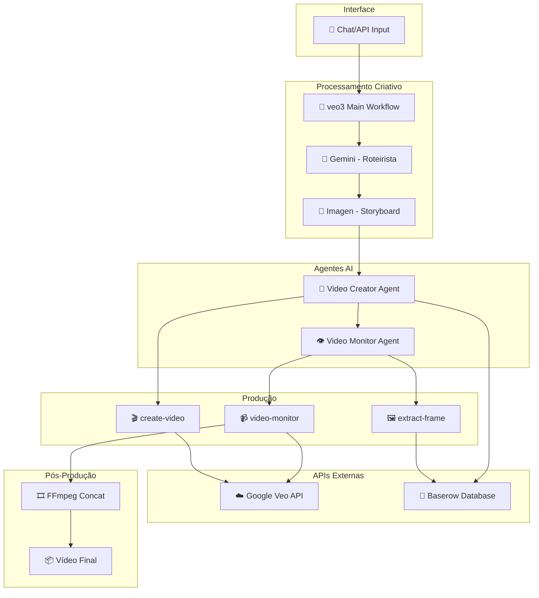

# 🎬 n8n Video Generator - Google Veo 3.0 Edition

[](https://n8n.io)
[](https://labs.google/veo/)
[](https://docker.com)
[](LICENSE)
[](https://github.com)

**Sistema automatizado de geração de vídeos cinematográficos usando n8n, Google Veo 3.0 e Inteligência Artificial**

## 🎯 Visão Geral

Este projeto implementa um pipeline completo de produção de vídeos automatizado, capaz de transformar prompts de texto em vídeos cinematográficos de alta qualidade. O sistema utiliza múltiplos agentes AI coordenados através do n8n para gerenciar todo o processo criativo e técnico.

### 🎥 Demonstração

> 🎬 **Exemplo**: "Crie um vídeo sobre um astronauta explorando Marte"
>
> O sistema gera automaticamente:
>
> - Roteiro cinematográfico detalhado
> - 5-10 cenas de 8 segundos cada
> - Transições visuais coerentes
> - Vídeo final concatenado em HD

## ✨ Características Principais

- 🤖 **Agentes AI Autônomos**: Gemini e Groq coordenam o processo criativo
- 🎨 **Google Veo 3.0**: Geração de vídeos de alta qualidade (1280x768 @ 8s)
- 📝 **Roteirização Inteligente**: Gemini cria roteiros cinematográficos detalhados
- 🖼️ **Continuidade Visual**: Sistema extrai frames para manter coerência entre cenas
- 📊 **Gestão de Estado**: Baserow rastreia progresso em tempo real
- 🎬 **Pós-produção**: FFmpeg concatena e processa o vídeo final
- ⚡ **Processamento Paralelo**: Múltiplas cenas geradas simultaneamente
- 🔄 **Retry Automático**: Sistema recupera de falhas automaticamente

## 🏗️ Arquitetura do Sistema



### 📁 Estrutura de Workflows

| Workflow          | Função                                | Tecnologias                |
| ----------------- | ------------------------------------- | -------------------------- |
| **veo3**          | Orquestrador principal com agentes AI | Gemini, Groq, n8n AI Agent |
| **create-video**  | Inicializa geração de vídeos          | Google Veo 3.0 API         |
| **video-monitor** | Monitora status e baixa vídeos        | Polling, WebHook           |
| **extract-frame** | Extrai frames para continuidade       | FFmpeg, Baserow            |
| **config-server** | Servidor de configurações             | HTTP, JSON                 |

## 📋 Pré-requisitos

### APIs Necessárias

| Serviço        | Tipo     | Obrigatório | Obtenção                                    |
| -------------- | -------- | ----------- | ------------------------------------------- |
| Google Gemini  | Gratuito | ✅ Sim      | [ai.google.dev](https://ai.google.dev/)     |
| Google Veo 3.0 | Preview  | ✅ Sim      | [labs.google/veo](https://labs.google/veo/) |
| Baserow        | Gratuito | ✅ Sim      | [baserow.io](https://baserow.io/)           |
| Groq           | Freemium | ⚠️ Opcional | [groq.com](https://groq.com/)               |
| Wavespeed      | Pago     | ❌ Opcional | [wavespeed.com](https://wavespeed.com/)     |

### Requisitos do Sistema

- **Docker**: versão 20.10+
- **Docker Compose**: versão 2.0+
- **RAM**: Mínimo 4GB (recomendado 8GB)
- **Armazenamento**: 10GB+ livre
- **CPU**: 4 cores+ recomendado
- **Internet**: Conexão estável (upload/download de vídeos)

## 🚀 Instalação

### Método 1: Setup Automatizado (Recomendado)

```bash
# Clone o repositório
git clone https://github.com/seu-usuario/n8n-video-generator.git
cd n8n-video-generator

# Execute o script de instalação
chmod +x setup.sh
./setup.sh
```

O script automatizado irá:

- ✅ Verificar todas as dependências
- ✅ Criar arquivos de configuração
- ✅ Baixar imagens Docker necessárias
- ✅ Configurar banco de dados
- ✅ Iniciar serviços
- ✅ Validar instalação

### Método 2: Instalação Manual

#### 1. Configure as variáveis de ambiente

```bash
# Copie o template
cp .env.example .env

# Edite com suas API keys
nano .env
```

#### 2. Configure o Docker Compose

```bash
# Inicie os containers
docker-compose up -d

# Verifique os logs
docker-compose logs -f n8n
```

#### 3. Importe os workflows

1. Acesse n8n: http://localhost:5678
2. Vá em **Workflows** → **Import**
3. Importe cada arquivo da pasta `workflows/`:
   - `veo3.json`
   - `create-video.json`
   - `video-monitor.json`
   - `extract-frame.json`
   - `config-server.json`

## ⚙️ Configuração

### 1. Google Gemini API

```bash
# Obtenha sua API key em: https://ai.google.dev/
GOOGLE_GEMINI_API_KEY=sua_key_aqui
```

### 2. Google Veo 3.0 (Preview Access)

⚠️ **Importante**: Google Veo está em preview limitado. [Solicite acesso aqui](https://labs.google/veo/).

```javascript
// Configuração no workflow create-video
{
  "model": "veo-001-preview",
  "prompt": "{{ $json.prompt }}",
  "duration": 8,
  "resolution": "1280x768"
}
```

### 3. Baserow Database

Crie a seguinte estrutura no Baserow:

#### Tabela: `video_scenes`

| Campo           | Tipo          | Descrição                           |
| --------------- | ------------- | ----------------------------------- |
| `scene_number`  | Number        | Número sequencial da cena           |
| `prompt`        | Long Text     | Prompt para geração                 |
| `video_url`     | URL           | Link do vídeo gerado                |
| `status`        | Single Select | pending/processing/completed/failed |
| `operation_id`  | Text          | ID da operação Veo                  |
| `created_at`    | Date          | Timestamp de criação                |
| `completed_at`  | Date          | Timestamp de conclusão              |
| `retry_count`   | Number        | Tentativas de processamento         |
| `error_message` | Long Text     | Mensagem de erro (se houver)        |
| `frame_url`     | URL           | URL do frame extraído               |

## 🎮 Uso

### Interface Web (Chat)

1. Acesse: http://localhost:5678
2. Abra o workflow `veo3`
3. Ative o Chat Trigger
4. Envie seu prompt:

```
Crie um vídeo épico sobre:
- Tema: Exploração espacial
- Duração: 60 segundos
- Estilo: Cinematográfico, cores vibrantes
- Cenas: Lançamento, viagem, chegada a novo planeta
```

### Via API

```bash
curl -X POST http://localhost:5678/webhook/video-generator \
  -H "Content-Type: application/json" \
  -d '{
    "prompt": "Astronauta explorando ruínas alienígenas em Marte",
    "duration": 40,
    "style": "cinematic, 4k, dramatic lighting"
  }'
```

### Resposta Esperada

```json
{
  "status": "processing",
  "workflow_id": "veo3_1234567890",
  "estimated_time": "5-10 minutos",
  "scenes": [
    {
      "scene": 1,
      "description": "Astronauta caminhando na superfície marciana",
      "duration": 8,
      "status": "pending"
    }
  ],
  "tracking_url": "https://baserow.io/database/xxx"
}
```

## 🔧 Personalização

### Ajustar Qualidade do Vídeo

```javascript
// Em create-video.json
const videoConfig = {
  model: "veo-001-preview",
  resolution: "1920x1080", // HD completo
  fps: 30, // Frames por segundo
  quality: "high", // low/medium/high
  duration: 8, // Segundos por cena
};
```

### Modificar Estilos Visuais

```javascript
// Em veo3.json - Prompt Engineering
const stylePrompts = {
  cinematic: "cinematic, dramatic lighting, 35mm film",
  anime: "anime style, vibrant colors, studio ghibli",
  realistic: "photorealistic, 8k, ray tracing",
  artistic: "artistic, oil painting style, renaissance",
};
```

### Configurar Agentes AI

```javascript
// Personalidade dos agentes
const agentConfig = {
  creator: {
    model: "gpt-4",
    temperature: 0.7,
    role: "Você é um diretor cinematográfico visionário...",
  },
  monitor: {
    checkInterval: 10000, // 10 segundos
    maxRetries: 3,
  },
};
```

## 📊 Monitoramento

### Dashboard Baserow

Acesse seu Baserow para ver em tempo real:

- Status de cada cena
- Progresso geral
- Erros e retry
- URLs dos vídeos gerados

### Logs n8n

```bash
# Logs em tempo real
docker-compose logs -f n8n

# Apenas erros
docker-compose logs n8n | grep ERROR
```

### Métricas de Performance

```bash
# Status dos containers
docker-compose ps

# Uso de recursos
docker stats n8n
```

## 🐛 Solução de Problemas

### Erro: "Google Veo API rate limit"

**Solução**: Veo tem limite de 10 requisições/minuto

```javascript
// Adicione delay entre requisições
await new Promise((resolve) => setTimeout(resolve, 7000));
```

### Erro: "Frame extraction failed"

**Solução**: Verifique FFmpeg

```bash
# Teste FFmpeg
docker exec n8n ffmpeg -version

# Reinstale se necessário
docker exec n8n apk add --no-cache ffmpeg
```

### Erro: "Baserow connection refused"

**Solução**: Verifique token e URL

```bash
# Teste conexão
curl -H "Authorization: Token SEU_TOKEN" \
  https://api.baserow.io/api/database/rows/table/ID/
```

### Vídeos não concatenando

**Solução**: Verifique formato consistente

```javascript
// Todos os vídeos devem ter:
// - Mesma resolução
// - Mesmo codec
// - Mesmo framerate
```

## 📈 Otimizações

### Performance

1. **Cache de Prompts**: Evita regenerar cenas idênticas
2. **Processamento Paralelo**: Até 3 cenas simultâneas
3. **Retry Inteligente**: Apenas cenas com falha

### Qualidade

1. **Frame Extraction**: Mantém continuidade visual
2. **Prompt Enhancement**: Gemini melhora descrições
3. **Quality Check**: Valida vídeos antes de concatenar

### Custo

1. **Batch Processing**: Agrupa requisições
2. **Smart Caching**: Reutiliza assets
3. **Fallback Models**: Usa modelos alternativos quando necessário

## 🤝 Contribuindo

Contribuições são bem-vindas! Por favor:

1. Fork o projeto
2. Crie sua feature branch (`git checkout -b feature/amazing-feature`)
3. Commit suas mudanças (`git commit -m 'Add amazing feature'`)
4. Push para a branch (`git push origin feature/amazing-feature`)
5. Abra um Pull Request

### Diretrizes

- Mantenha a compatibilidade com n8n latest
- Adicione testes para novas features
- Atualize a documentação
- Siga o estilo de código existente

## 📄 Licença

Este projeto está licenciado sob a MIT License - veja o arquivo [LICENSE](LICENSE) para detalhes.

## 🙏 Agradecimentos

- [n8n.io](https://n8n.io) - Plataforma de automação
- [Google AI](https://ai.google.dev) - APIs Gemini e Veo
- [Baserow](https://baserow.io) - Database no-code
- [FFmpeg](https://ffmpeg.org) - Processamento de vídeo
- Comunidade n8n - Suporte e inspiração

## 📞 Suporte

- **Issues**: [GitHub Issues](https://github.com/seu-usuario/n8n-video-generator/issues)
- **Discussões**: [GitHub Discussions](https://github.com/seu-usuario/n8n-video-generator/discussions)
- **Email**: seu-email@exemplo.com
- **Discord**: [n8n Community](https://discord.gg/n8n)

## 🚦 Status do Projeto

- [x] Core do sistema funcionando
- [x] Integração Google Veo 3.0
- [x] Sistema de agentes AI
- [x] Concatenação de vídeos
- [ ] Interface web dedicada
- [ ] Suporte a múltiplos idiomas
- [ ] Templates de vídeo
- [ ] Exportação em múltiplos formatos

---

**Feito com ❤️ usando n8n e Google Veo 3.0**

_Este projeto não é afiliado oficialmente ao Google ou n8n_
